***

# Setup

## Once and for all setup

### Cloning a Git Repository

- Open Rstudio on your computer. If you don't have Rstudio, please download it from [here](https://rstudio.com/products/rstudio/download/#download).

- Go to "File" > "New Project". In the popped-up window, select "Version Control" > "Git", put "https://github.com/GT-Lerouxlab/lab_website.git" under "Repository URL", and press "Create Project".
    - You can change the directory (location) of this project under "Create project as subdirectory of:" at "Browse...". 

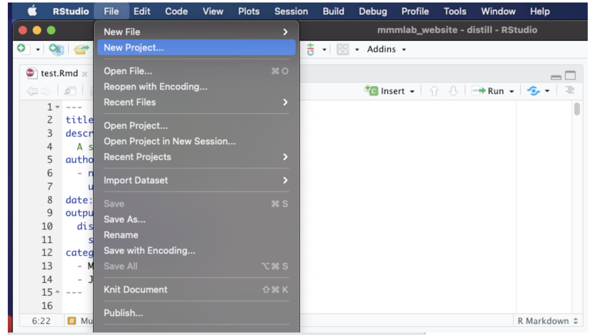
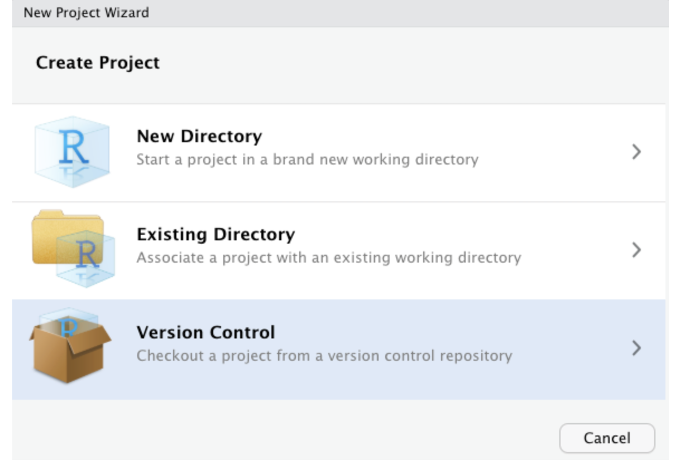

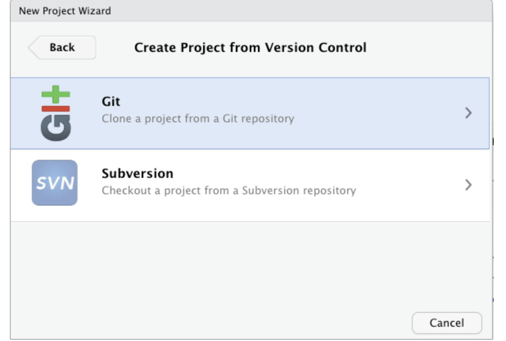

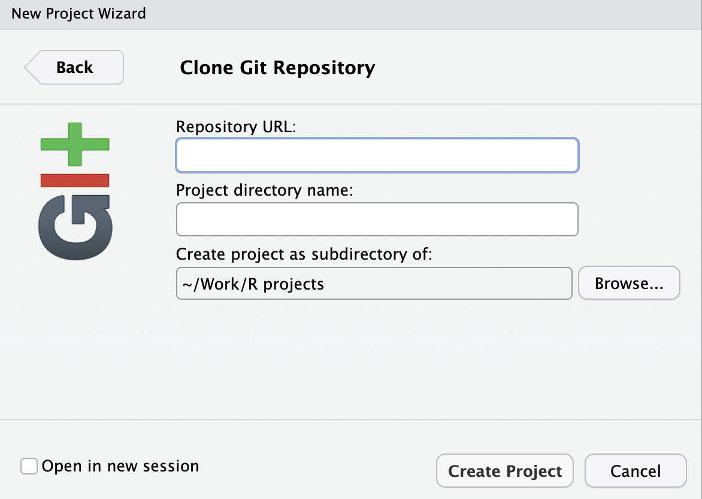

- There you go! You now have everything that is up on the remote Git repository on your local repository.

### Install Packages

- Install necessary packages by running the following in your console

```{r eval=FALSE}
install.packages(c("distill", "RefManageR", "bibtex"))
```

***

## Recurrent setup

### "Pull", "Commit", "Push" Habits

To avoid conflicts from your and others' changes on the website files, a good habit is to first **pull** files from Github before starting to make changes and to **commit** and **push** your changes right after you finished making changes. 

- Every time before you start working on your local repository, remember to first **pull** the content from the remote repository. This makes sure that your local repository is up-to-date to the changes someone else might have made. 

    - Click on the blue downward arrow under the "Git" tab and make sure, from the popped-up window, you get the "Already up to date" (or similar) message. If you do, then you can proceed to make changes in the files. 

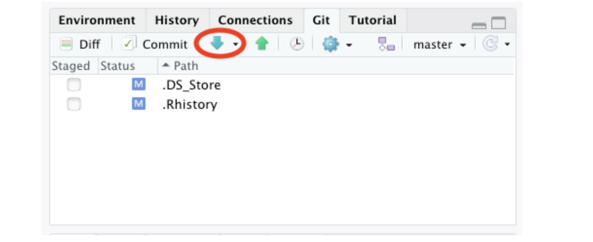
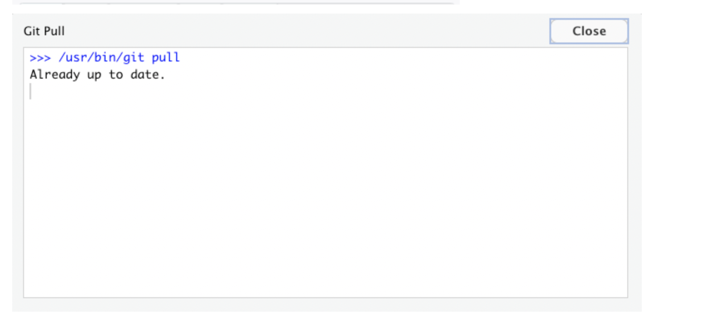

- Every time after you made changes on your local repository, remember to 
    a. **commit** the changes by clicking on "Commit" under "Git", checking all changed files, typing in a "Commit message", and sending "Commit", and
    b. click on the green upward arrow to **push** your changes to the remote repository.
    
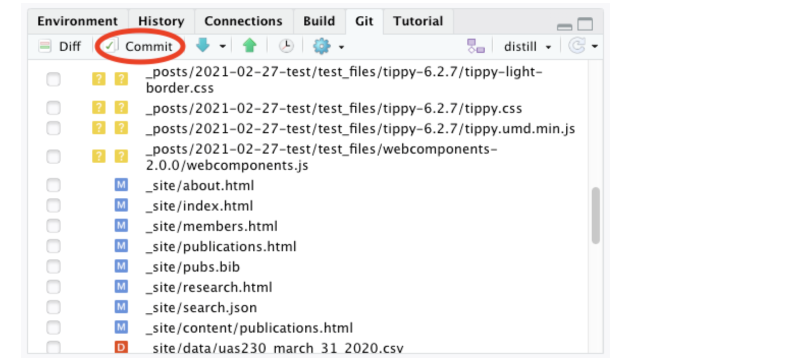
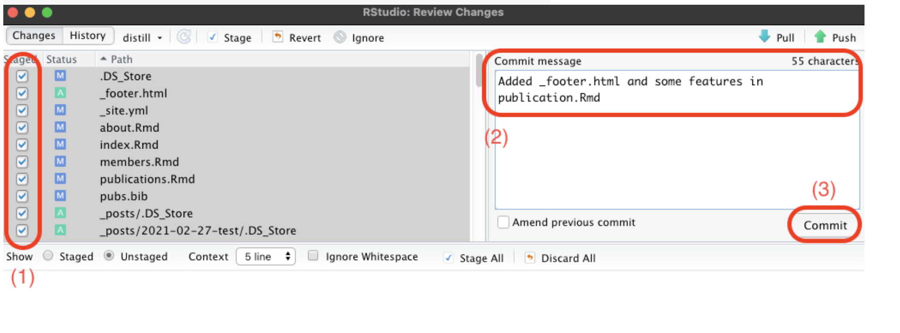

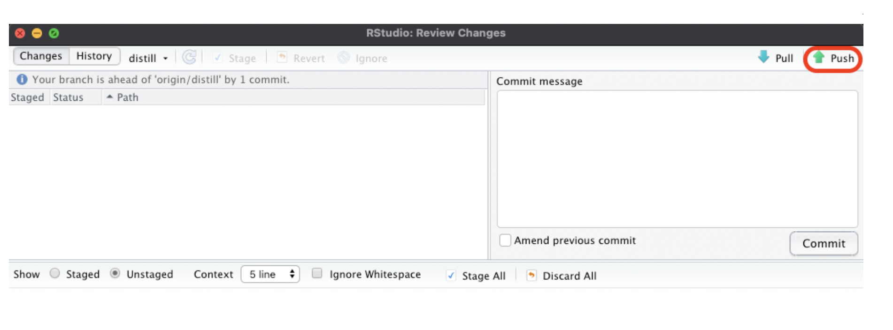

This allows sharing the changes you made in your local repository to the Github repository. After successfully committing and pushing changes, you are good to go for the updates you just made :)

***

# Preview Changes

To preview the website, click on "Build Website" under "Build. 

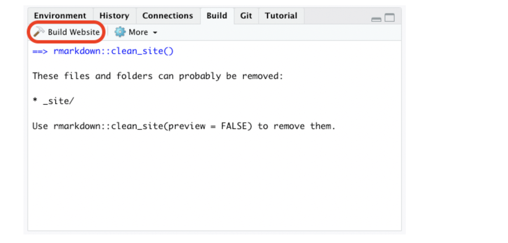

Under "Viewer", we can preview the mobile-sized version of the website. You can also open up a desktop-sized version of the website by clicking on the "Show in new window" button (circled in red down below). 

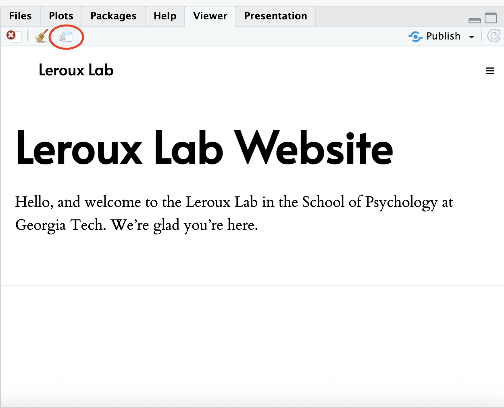

***

# Major Maintenance Tasks

## (1) Profiles of Lab Members

- File to update: `members.Rmd`

This page contains the profile of our lab members, including our principal investigator, graduate students, undergraduate students, and collaborators. The content of a profile may include, a short bio, a CV, a link to a personal website, and an email address of a lab member. Your responsibility includes collecting this information from our lab members and updating it on the website. 

### R Markdown Syntax

Some essential R Markdown syntax is common on this page (and others as well). 

#### 1. Headers
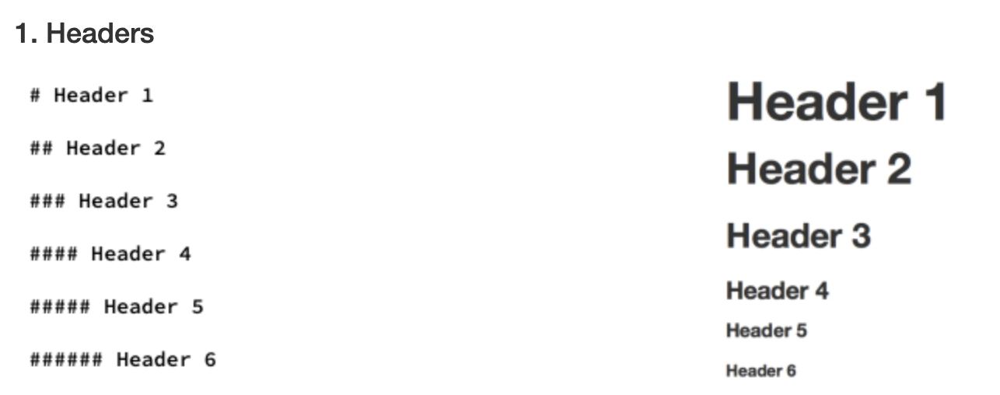

#### 2. Bold / italicize
  - `**bold**`, **bold**
  - `*italics*`, *italics*
  
#### 3. List
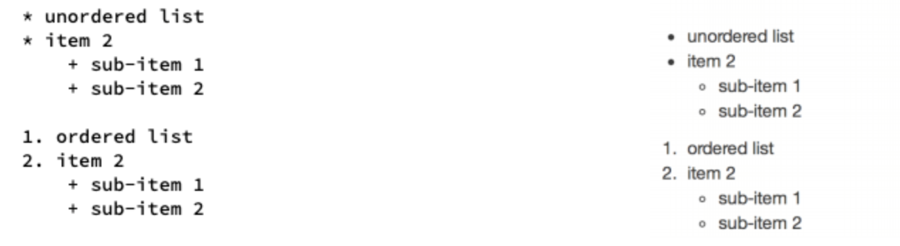

#### 4. Horizontal rule
  - To divide up sections, use a horizontal rule `***`
  
#### 5. Hyperlinks
  - CVs
      - If you receive a new / an updated CV, place that file in the folder "static", "cv". 
      - To hyperlink someone's CV to the word "CV" in `publication.Rmd`: `[CV](static/cv/file name)`
      
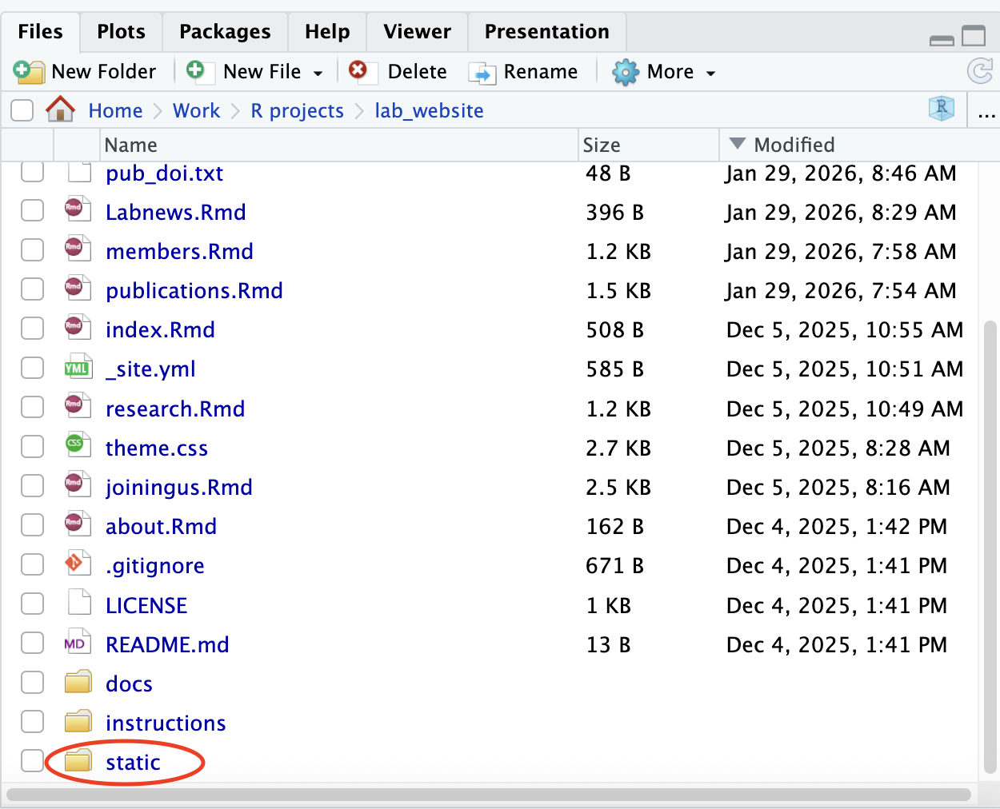
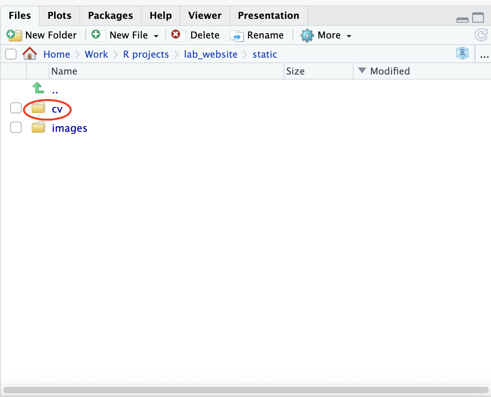

  - Image
      - If you receive a new picture, place that picture in the folder "static", "images". 
      - To hyperlink a picture: ``
          - I encourage you to include an alternative text in the square brackets every time you add a new picture. The text briefly describes the picture (e.g., ``; see this example under `about.Rmd`). 
          - The alternative text will not appear on the webpage unless the link is broken, which may occur occasionally. It allows others to recognize the content of the picture even with a broken link. 
      - If you receive an external link to a picture, you can create a code chunk by pressing `Command + Shift + i` for mac users or `Ctrl + Shift + i` for Windows users and use the command `knitr::include_graphics("link")` in the code chunk. See below as an example. 

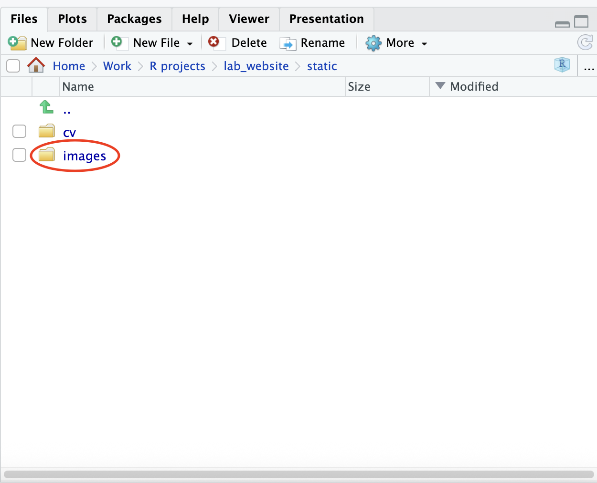

```{r eval=FALSE}
knitr::include_graphics("https://quantscience.rbind.io/author/hok-chio-mark-lai-%E9%BB%8E%E5%AD%B8%E6%98%AD/avatar_hu5fee5d8532847d51fbb6966683aaaac0_71984_270x270_fill_q90_lanczos_center.jpg")
```

  - External links to a webpage
      - `[text](link)`
      - Texts within the square brackets will appear on the webpage while the link will not. Clicking on the texts will get us to the external webpage. 
  
If you are interested in learning more Markdown syntax, please visit this [cheatsheet](https://rstudio.com/wp-content/uploads/2015/02/rmarkdown-cheatsheet.pdf). 


***

## (2) Publications

- File to update: `publication.Rmd`

From time to time, you will receive information of our lab members' latest publication. They may be (1) already published articles with a DOI, (2) accepted or in press articles, and (3) conference presentations. 

1. For published articles with a DOI (e.g., "10.1016/j.addbeh.2018.11.029"), in the command of `RefManageR::GetBibEntryWithDOI()`, add the DOI in a new line. For example, 
    
```{r eval=FALSE}
RefManageR::GetBibEntryWithDOI(
  unique(
    c("10.1080/10705511.2020.1782206", 
      "10.1037/met0000287") # new DOI added here
  ), 
  temp.file = "pubs.bib", 
  delete.file = FALSE)
```

2. For unpublished but accepted articles without a DOI, manually input the details of the article using `BibEntry()` and save it to `ref`. For example, 

```{r eval=FALSE}
ref <- c(
  BibEntry(
    bibtype = "unpublished", 
    key = "firstauthor_year", 
    title = "article name", 
    author = "author 1 last name, first name and author 2 last name, first name, etc.", 
    year = "year", 
    journal = "journal name", 
    date = "date accepted", # optional
    pubstate = "Manuscript accepted for publication"
  )
  # add more down below
)
```

3. For conference presentations, we currently need to manually format their citations (I may customize a `bibtype` later in time). The format is as follows:
  
    - Authors (year, month dates). *Conference presentation title* [Paper Session/Poster Session/Symposium/etc.]. Conference name, Location, States, Coutnry. `[Schedule/Powerpoint slides](link)`. 
    
***

# Concluding Remarks

Don't worry -- I am always here to help. Problems occur all the time particularly at the beginning. Whenever issues come up -- broken links and images, failing to knit or build the website, or getting lost in all these tasks, you are always welcome to ask help from me. It will always be helpful for me to understand better your situation if you screenshot what problems you have on your end and briefly describe how you get there. 

Hope you have fun playing around with the website :) Don't hesitate to reach out to me if you find the workload too heavy or if you have any concerns!


